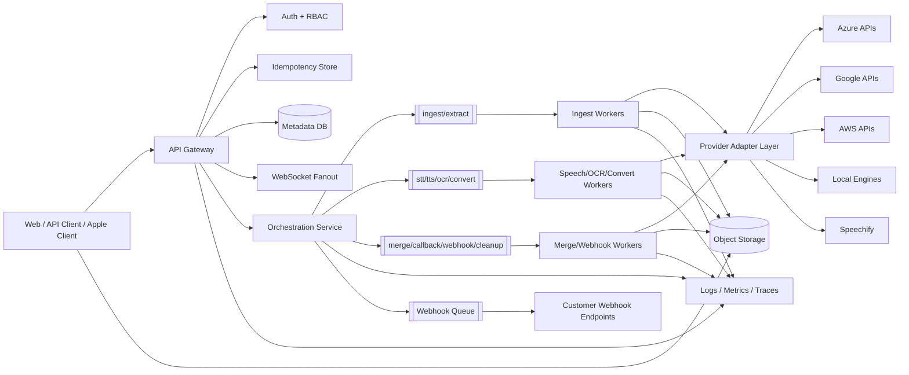
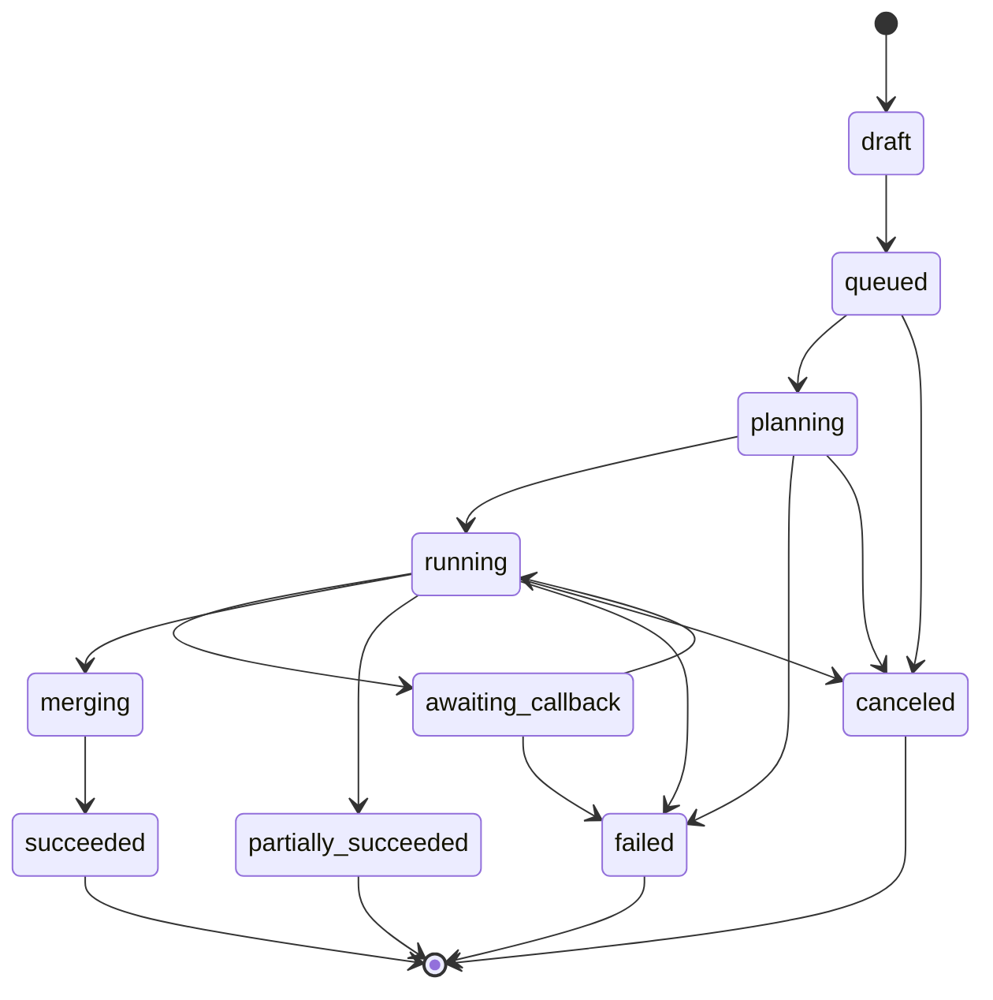

# 3) System Architecture + Diagrams

Date: 2026-04-15
Cloud baseline: Azure-primary (multi-provider adapters)

## High-Level Design
- Frontend web app + Apple-native client module
- API gateway/control plane
- Orchestration engine
- Async queues and worker pools
- Object storage for binaries
- Metadata database for job state/audit
- Cache for quotas/idempotency/session fanout
- Observability stack (logs, metrics, traces, alerts)

## Architecture Diagram

## Job State Machine

## Queue / Retry / DLQ Policy
- Retryable: network timeouts, transient storage errors, provider 429/5xx.
- Non-retryable: validation errors, unsupported formats, forbidden policy routes.
- Backoff: exponential + jitter (`base * 2^attempt + jitter`), capped per class.
- DLQ on exhausted retries with payload + tenant + trace context.
- Replay only through operator/admin endpoint with idempotency protection.

## Concurrency + Backpressure
- Per-tenant concurrent job caps.
- Per-provider token bucket limits.
- Admission throttling on queue age/depth thresholds.
- Degraded mode: prioritize in-progress merges + webhook delivery.

## Idempotency Strategy
- External API scope: `(tenantId, endpoint, idempotency-key)`.
- Step scope: `step:{jobId}:{stepType}:attempt:{n}`.
- Provider call scope: `provider-call:{jobId}:{provider}:{operation}`.

## Partial Result Pipeline
- Long jobs emit partial artifacts (`transcript.partial`, `audio.partial`) before merge.
- Clients receive `artifact.ready` websocket/webhook events per stage.
- Final merge publishes immutable artifact manifest with component lineage.
